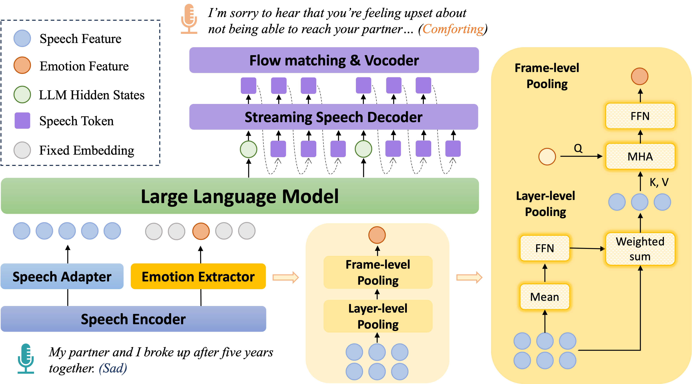

# FreezeEmpath: Efficient Training for Empathetic Spoken Chatbots with Frozen LLMs

> [Yun Hong](https://hongyun2002.github.io/), [Yan Zhou](https://zhouyan19.github.io/zhouyan/), [Yang Feng*](https://people.ucas.edu.cn/~yangfeng)

Source code for our Findings of ACL 2026 paper: **FreezeEmpath: Efficient Training for Empathetic Spoken Chatbots with Frozen LLMs**.

  

